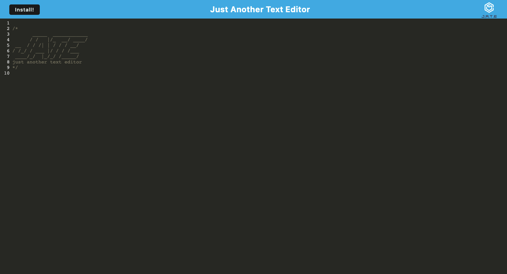

# Text Editor App (PWA)

## Description

Users can use this web application as a text editor (mode JavaScript). There are options to download it as well as work with it offline. Data can be saved and retrieved. The link to the repository is provided below. From there, the use of the following can be observed:

- webpack, webpack-cli, html-webpack-plugin, css-loader, style-loader, workbox-webpack-plugin, babel, idb, CodeMirror, webpack-pwa-manifest, Express.js, among others. (please visit the repository for more details about all that was used).
- the starter code and the framework provided by edX Boot Camps LLC

## Links

Deployed to Heroku - the link to the deployed application: https://lit-island-78121.herokuapp.com/

The link to the repository: https://github.com/jamscc/pwa-text-editor-app

## Screenshot

